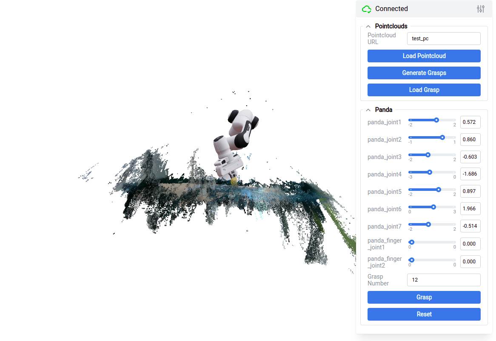
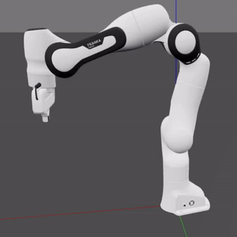

# franka_grasp_baseline
Table top manipulation based on franka fr3 robot arm and graspnet, including calibration, 3d reconstruction and grasping. 

## Install
For caclibration:

- Please install numpy, open3d, opencv-python, opencv-contrib-python. 
- The code is tested on python 3.8 and python 3.10, you may try other version.

For grasp:

- Please refer to [graspnet](https://github.com/graspnet/graspnet-baseline) and [lerftogo](https://github.com/lerftogo/lerftogo). 
- The code is tested on python 3.8, you may try other version.

## harwares
- The code is tested on realsense 405/435(tested), other realsense cameras may also work.
- The code is tested on franka emika research 3, the code should also work on franka panda.

## Usage

Overall pipeline:

1. Use "hand_in_eye_shooting.ipynb" in "examples/hand_in_eye" to collect wrist arm data.
    - The calibration board is genereted by [calib.io](https://calib.io/pages/camera-calibration-pattern-generator).
2. Use "hand_in_eye_calib.ipynb" in "examples/hand_in_eye" to do calibration and generate pointcloud with tsdf.
3. Put the pointcloud in "./examples/graspnet/pointclouds" and run gen_grasp.py to generate grasp. 
    1. Click "Load Pointcloud" to visualize pcd.
    2. Click "Generate Grasp" to get the grasps.
    3. Select best grasp with "Grasp Number".
    4. Click "Grasp" to do IK and save the joints angle.
4. Use "grasp_test.ipynb" to control the robot arm do real world task.

Additional notes:

- The Pipeine is based on only wrist camera, and the intrinsics are from realsense. You may further calibrate them but the inner params work well.
- Hand-to-eye is based on eye-to-eye and hand-in-eye, which is not a standard method.
- You may check other examples about realsense usage, eye-to-eye/hand-to-eye calibration and intrinsic calibration. The data fromat is shown in the folder "eye_to_eye" and "hand_in_eye". 

## Applications

    

    
    

## TODO
- Hand to eye calibration with a mark on the arm.
- Automatic data collection with spherical view points.
